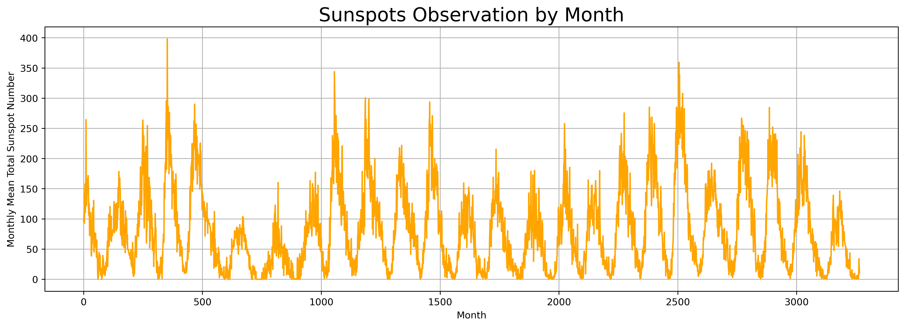

Predicting Sunspots with DNN, Simple RNN and LSTM
=================================================

***Time Series Data Analysis***

# Introduction

Sunspots are temporary dark regions on the sun's surface. They are a key measure of solar activity, which affects many aspects of human society on Earth, such as navigation systems, power systems, and spacecrafts etc. Predicting the number of sunspots helps scientists to minimise its negative impact. 


## Problem

This project aims to devise a robust Deep Learning (DL) model to predict sunspot numbers by recognising patterns in sunspot time series data. 

## Objectives

1. Time series analysis of sunspots with statistics tool

1. Baseline prediction - moving average and data shifting

1. Use DNN to make sunspot number prediction
    - Hyperparameter tuning

1. Use RNN to make sunspot number prediction
    - Hyperparameter tuning

1. Use LSTM to make sunspot number prediction
    - Hyperparameter tuning

1. Compare performance

## Source of data

[Kaggle Sunspots](https://www.kaggle.com/datasets/robervalt/sunspots/data)

Data download instrucitons

source: https://www.kaggle.com/datasets/robervalt/sunspots/data

Download dataset from Kaggle
(These commands work in MacOS terminal too. Just drop the '!' and run them in the terminal.)

Install Kaggle API if you don't have it. (Uncomment the line below.)
```
%pip install kaggle
```

Put Kaggle token to the required directory `[~/.kaggle/kaggle.json]`
```
!mkdir ~/.kaggle && mv ~/Downloads/kaggle.json ~/.kaggle/
```

Check setup is successful. 
```
!ls ~/.kaggle
```

Show the desired dataset. 
```
!kaggle datasets list -s 'name_of_your_dataset'
```
dataset name: robervalt/sunspots

Download dataset.
``` 
!kaggle datasets download -d 'username/name_of_the_dataset' 
```

Unzip the zip file.
```
!unzip name_of_the_dataset.zip
```

Inspect the dataset. 
```
!head name_of_the_dataset.csv
```

# Time Series Analysis with Statistical Tools

A time series is a sequence of data points that occur in successive order over some period of time. The sunspot dataset consists of montly readings of sunspot activity from 1749 to 2018. Hence, we will first look for some patterns in the sunspot time series. 

## Properties of a Time Series 

Here are some components of time series we should know:

- *Trend*: a general direction of the time series data over a long period of time
- *Seasonality*: a trend that repeats with respect to timing, direction, and magnitude within each year. 
    - They will occur around the same time each year. E.g.: an increase in energy consumption in winter due to cold weather condition.
- *Cycle*: Oscillations in the time series that last more than a year are considered cyclic.
- *Irregularity*: Random and unforeseen variations, such as natural disasters. 
- *Stationarity*: A non-stationary series has a constant variance, mean, and covariance. 

Now, let's take a look at the visualisation of the sunspots data. 



We can see that sunpots have seasonal cycles. Many scientists believe this cycle is approximately **11 years**. 

This conclusion would help us to determine the optimal period value when conducting statistical analysis in the baseline forecasting notebook. 

Here's some examples of stationary and non-stationary time series. From the examples below, the sunspot series is most likely a stationary time series. We will prove this through statistical test in the notebook.


## Summary

The initial analysis has helped us to reveal some insights from the sunspot time series data.

By ADF test, we confirmed that this is a stationary time series, with constant mean, variance and autocorrelation. It's not seasonal either. 

However, it does have a cyclic period around 11 years. 

Among many statistical forecasting methods, the naive forecast method generates the best prediction performance, with a MAE value of 14.84. 

What's more, We used moving average and differencing techniques to generate forecasts. Moving average depicts the trend very well but does not give good prediction results. 

Combining both differencing and moving average techniques, the prediction MAE will be slightly improved. 

# Hyperparameter Tuning

<!-- Data Preprocessing Methods

- Data windowing
- Data Slicing with Tensorflow -->

Table: The list of hyperparameter combinations

Tools

- `keras-tuner` - this works!
- `Sklearn.model_selection.GridSearchCV` and `scikeras`

Issues

- Data input errors when fitting training data into model. 
- Limited flexibility to tune batch size, window size and number of layers. 
- Need more randomness and wider coverage on learning rate. 

Trivial questions

- What's the difference between shape (30,) and shape (30, 1)?

# Logs

2024-12-30

- Debug kerastuner function for hyperparameter tuning. It is necessary to tune learning rate separately or deploy a continuous range in the search space. 

2025-1-5

- Use notebooks to describe data and justify actions. 
- Use README.md to describe experitment method, key findings, and conclusions. Point reader to corresponding notebook whenever needed. 

2025-1-8

- Visualise experiment archietecture. 
- Readers need to know the experiment result and the most recommended method. (Supported with charts)
- Loss decline curve
- Performance comparison table and candle chart.
- Null hypothesis to confirm the performance difference. Need to repeat each algorithm 10 times and collect MAEs and MSEs. 
- p-value table. 